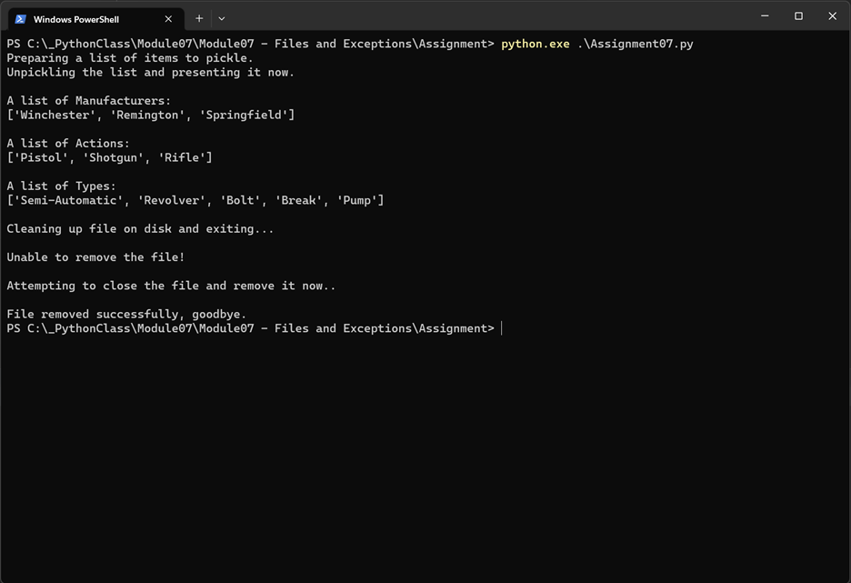
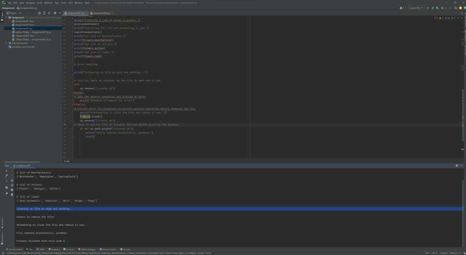

Nathan Shelby

29MAY2023

Foundations of Programming: Python

Assignment 07

https://github.com/Nebulis01/IntroToProg-Python-Mod07

https://nebulis01.github.io/IntroToProg-Python-Mod07/

# Assignment 07: Pickling, Errors and Exceptions (oh my!)
## Introduction:

This is the 7th assignment, part of Module 7 performed as part of the Foundations of Programming: Python course for the Spring 2023 session at University of Washington. The task list includes reading chapter 7 of the coursebook, perform research on how two areas of Python operate – Pickling and Error Handling – once research has been completed, we need to write code to demonstrate both concepts.  

## Creating your script:

In this script we perform some basic operations to demonstrate Python’s Pickling feature by using defined list data to write binary out to a file, firearms.db, which we then read back. To demonstrate the exception and error handling process we attempt to delete the file while it is still open, which triggers an exception which we then handle by closing the file properly and performing the delete again, only after verifying the file is not present on disk do we exist the program. 

While looking at the Pickling module I found several resources that assisted in my understanding of the module:

https://docs.python.org/3/library/pickle.html - The official documentation is very detailed, and is explicitly clear of the severity of risk for handling external data using the module as you can quickly open yourself to an RCE 

https://www.tutorialspoint.com/python-pickling - This site provided a good overview of practical applications for simple lists and dictionaries.

https://realpython.com/python-pickle-module/ - This provided a good example of how to pickle over a remote listener and if you’d like to set that up how easy it would be to execute arbitrary code via the process. 

The script is basic, enough to demonstrate principles and that’s it. Utilizing the picklesomeitems() function we take provided data and write it to disk for use later. 

```
def picklesomeitems():
    # Creating a selection of items to pickle
    firearm_manufacturer = ["Winchester", "Remington", "Springfield"]
    firearm_type = ["Pistol", "Shotgun", "Rifle"]
    firearm_action = ["Semi-Automatic", "Revolver", "Bolt", "Break", "Pump"]

    # Opening a file, using 'wb' to write binary data, creating as required, overwriting if exists
    f_db = open("firearms.db", "wb")

    # Place the items in the database
    pickle.dump(firearm_manufacturer, f_db)
    pickle.dump(firearm_type, f_db)
    pickle.dump(firearm_action, f_db)

    # ensure the file handle is closed and items are written to disk
    f_db.close()
```
### picklesomeitems() 

We then unpickle the content, picking it up from disk and placing it in a few global variables for use. 

```
def unpicklesomeitems():
    #globalize variables for reuse
    global firearm_manufacturer, firearm_action, firearm_type, f_db_ro
    #ensure variables are empty
    firearm_manufacturer = None
    firearm_action = None
    firearm_type = None

    # Open file to read, using 'rb' to read binary data
    f_db_ro = open("firearms.db", "rb")

    # unpickle the object and return it to variable for use
    firearm_manufacturer = pickle.load(f_db_ro)
    firearm_action = pickle.load(f_db_ro)
    firearm_type = pickle.load(f_db_ro)
```
### unpicklesomeitems()

To provide proof of function we print the data back to the console and to exercise the exception process we attempt to delete a file which we know to be open, thus throwing an exception which causes the message “Unable to remove the file!” to be displayed. We then proceed to execute the required steps to perform cleanup on disk and exit the program. 

```
# Error Handling
print("\nCleaning up file on disk and exiting...")
# This try fails on purpose, as the file is open and in use
try:
    os.remove("firearms.db")
except:
# Take the general exception and provide an error
    print("\nUnable to remove the file!")
finally:
# Proceed after the exception to perform another operation before removing the file
    print("\nAttempting to close the file and remove it now..")
    f_db_ro.close()
    os.remove("firearms.db")
# Check to see the file is actually deleted before printing the goodbye.
    if not os.path.exists("firearms.db"):
        print("\nFile removed successfully, goodbye.")
        exit()
```
### A Forced Exception

The book again (and likely why it’s part of class materials) is very decent at demonstrating the exceptions process in Python. 

https://docs.python.org/3/tutorial/errors.html - the official docs also provide additional context for how exceptions and errors can be handled. 

https://realpython.com/python-exceptions/ - Well thought out explanations and graphics which show clearly how the interpreter is handling the process. 

# Summary

This week we learned how to pickle and unpickle data in Python along with utilizing some error handling. The ask was different from previous weeks due to the lack of defined structure and framework for the coding ask, much like what you experience in real world settings. Proof of execution is provided below. 
  


